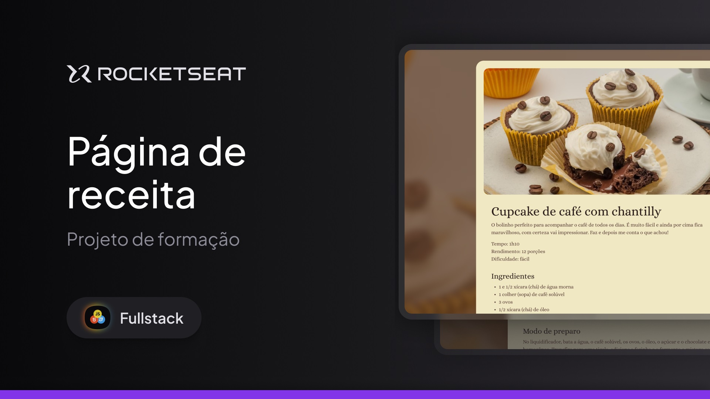

<h1 align="center"> Págida de Receita </h1>

Programa exclusivo, promovido pela Rocketseat para ensino de tecnologias WEB.  
<a href="https://app.rocketseat.com.br/cart/formacao-fullstack?referral=fernando-parise&coupon=indicamgm&utm_source=platform&utm_medium=organic&utm_campaign=venda&utm_term=mgm&utm_content=indication-lp_one">Estude esse projeto em formato de vídeo clicando aqui.</a>

  <a href="#-tecnologias">Tecnologias</a>&nbsp;&nbsp;&nbsp;|&nbsp;&nbsp;&nbsp;
  <a href="#-projeto">Projeto</a>&nbsp;&nbsp;&nbsp;|&nbsp;&nbsp;&nbsp;
  <a href="#-layout">Layout</a>&nbsp;&nbsp;&nbsp;|&nbsp;&nbsp;&nbsp;
  <a href="#memo-licença">Licença</a>

  

 

  

## 🚀 Tecnologias

Esse projeto foi desenvolvido com as seguintes tecnologias:

- HTML e CSS
- Git e Github
- Figma

## 💻 Projeto

A Página de Receitas é uma páginas que mostra as receitas online.

- [Acesse o projeto finalizado, online](https://fernando-parise.github.io/paginaDeReceita/)

## 🔖 Layout

Você pode visualizar o layout do projeto através [DESSE LINK](https://www.figma.com/design/uT8YNFW2YiyUGDNlT3nI1A/P%C3%A1gina-de-receita--Community-?node-id=0-1&p=f&t=EgNJJzcnJDqPmK3f-0). É necessário ter conta no [Figma](https://figma.com) para acessá-lo.

## :memo: Licença

Esse projeto está sob a licença MIT.

---

Feito com ♥ by Rocketseat :wave: [Participe da nossa comunidade!](https://discord.gg/rocketseat)
